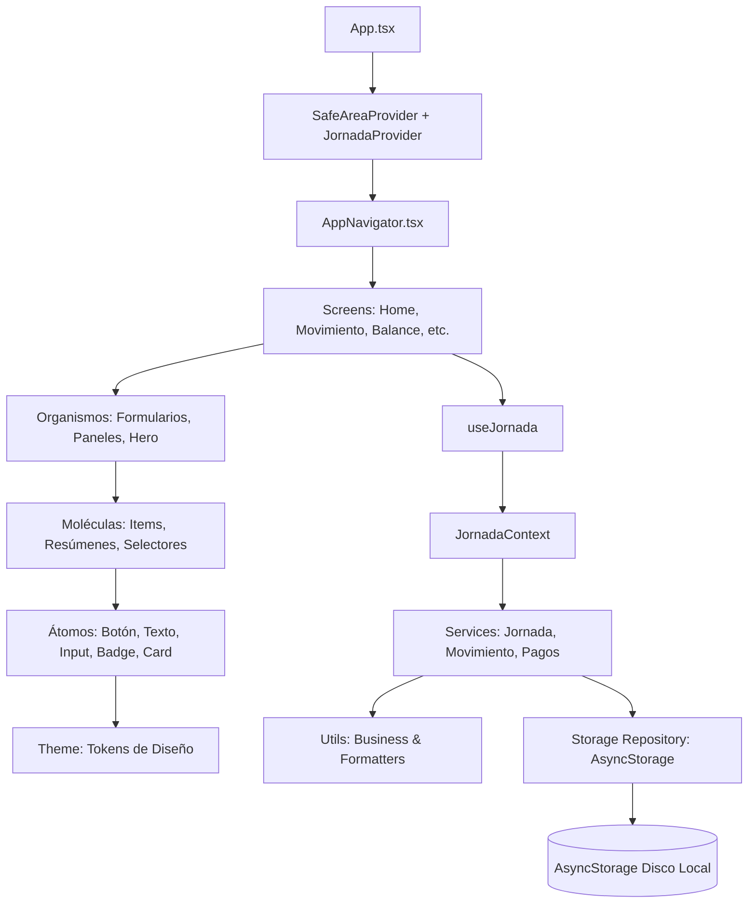

# Análisis Integral del Código: CuadramosApp

Este documento proporciona una auditoría y desglose detallado de todos los archivos modificados y agregados en el commit de la aplicación **CuadramosApp**.

Para cada archivo se detalla:
1. **¿Qué cumple?**: Su propósito, responsabilidad y contrato en el sistema.
2. **¿Es de diseño?**: Si pertenece a la capa visual/estilos (UI), lógica de negocio, configuración o infraestructura.
3. **¿Qué datos tiene?**: Interfaces, estructuras de datos, tipos de TypeScript, props o estados que almacena o manipula.
4. **¿Qué es lo que está haciendo?**: Su comportamiento en tiempo de ejecución, algoritmos, efectos secundarios e interacciones con otros módulos.

---

## 🗺️ Mapa de Arquitectura y Flujo de Dependencias

El proyecto sigue una arquitectura limpia combinada con **Atomic Design** en la capa de presentación:

---

## 📊 Matriz Clasificatoria de Archivos

| Archivo | ¿Es de diseño? | Capa / Dominio | Rol Principal |
| :--- | :---: | :--- | :--- |
| [App.tsx](file:///c:/Users/joses/Documents/test4/CuadramosApp/App.tsx) | No (Contenedor) | Raíz de la Aplicación | Punto de entrada e inyección de Providers globales |
| [docs/ARQUITECTURA.md](file:///c:/Users/joses/Documents/test4/CuadramosApp/docs/ARQUITECTURA.md) | No (Doc) | Documentación | Guía de arquitectura y reglas de capas |
| [setup-rn-env.sh](file:///c:/Users/joses/Documents/test4/CuadramosApp/setup-rn-env.sh) | No (Script) | DevOps / Entorno | Script Bash para configurar Java 17 y Android SDK |
| [package.json](file:///c:/Users/joses/Documents/test4/CuadramosApp/package.json) | No (Config) | Configuración | Dependencias y scripts del proyecto |
| [package-lock.json](file:///c:/Users/joses/Documents/test4/CuadramosApp/package-lock.json) | No (Config) | Configuración | Árbol de dependencias bloqueadas |
| [jest.config.js](file:///c:/Users/joses/Documents/test4/CuadramosApp/jest.config.js) | No (Config) | Testing | Configuración del ejecutor de pruebas Jest |
| [jest.setup.ts](file:///c:/Users/joses/Documents/test4/CuadramosApp/jest.setup.ts) | No (Testing) | Testing | Mocks globales en memoria de AsyncStorage |
| [__tests__/services.test.ts](file:///c:/Users/joses/Documents/test4/CuadramosApp/__tests__/services.test.ts) | No (Testing) | Pruebas Unitarias | Validación de saldo, bloqueo de cierre y pagos |
| [src/theme/foundations/tokens.ts](file:///c:/Users/joses/Documents/test4/CuadramosApp/src/theme/foundations/tokens.ts) | **SÍ (100% Diseño)** | Tokens de Diseño | Paleta de colores, tipografías, espaciados, sombras |
| [src/theme/index.ts](file:///c:/Users/joses/Documents/test4/CuadramosApp/src/theme/index.ts) | **SÍ (Exportación)** | Tokens de Diseño | Exportador público de tokens |
| [src/atoms/actions/AppButton.tsx](file:///c:/Users/joses/Documents/test4/CuadramosApp/src/atoms/actions/AppButton.tsx) | **SÍ (UI Component)** | Átomos | Botón estándar con variantes, estados de carga y toque |
| [src/atoms/display/AmountDisplay.tsx](file:///c:/Users/joses/Documents/test4/CuadramosApp/src/atoms/display/AmountDisplay.tsx) | **SÍ (UI Component)** | Átomos | Renderizador de montos monetarios en PEN con color semántico |
| [src/atoms/display/AppText.tsx](file:///c:/Users/joses/Documents/test4/CuadramosApp/src/atoms/display/AppText.tsx) | **SÍ (UI Component)** | Átomos | Tipografía base del sistema de diseño |
| [src/atoms/display/Icon.tsx](file:///c:/Users/joses/Documents/test4/CuadramosApp/src/atoms/display/Icon.tsx) | **SÍ (UI Component)** | Átomos | Renderizado de glifos/iconos visuales |
| [src/atoms/display/StatusBadge.tsx](file:///c:/Users/joses/Documents/test4/CuadramosApp/src/atoms/display/StatusBadge.tsx) | **SÍ (UI Component)** | Átomos | Píldora de estado con color de fondo y texto semántico |
| [src/atoms/form/AppInput.tsx](file:///c:/Users/joses/Documents/test4/CuadramosApp/src/atoms/form/AppInput.tsx) | **SÍ (UI Component)** | Átomos | Campo de texto accesible con etiqueta y mensaje de error |
| [src/atoms/layout/Card.tsx](file:///c:/Users/joses/Documents/test4/CuadramosApp/src/atoms/layout/Card.tsx) | **SÍ (UI Component)** | Átomos | Contenedor en tarjeta con sombra, radio y fondo blanco |
| [src/atoms/layout/Divider.tsx](file:///c:/Users/joses/Documents/test4/CuadramosApp/src/atoms/layout/Divider.tsx) | **SÍ (UI Component)** | Átomos | Línea divisoria de 1 pixel (`hairlineWidth`) |
| [src/atoms/index.ts](file:///c:/Users/joses/Documents/test4/CuadramosApp/src/atoms/index.ts) | **SÍ (Exportación)** | Átomos | Exportador de la capa atómica |
| [src/molecules/balance/BalanceSummary.tsx](file:///c:/Users/joses/Documents/test4/CuadramosApp/src/molecules/balance/BalanceSummary.tsx) | **SÍ (UI Component)** | Moléculas | Tarjeta resumen con saldo actual, ingresos, egresos y retiros |
| [src/molecules/feedback/ConfirmationMessage.tsx](file:///c:/Users/joses/Documents/test4/CuadramosApp/src/molecules/feedback/ConfirmationMessage.tsx) | **SÍ (UI Component)** | Moléculas | Banner flotante de alerta/éxito/error dismissable |
| [src/molecules/movements/MovementItem.tsx](file:///c:/Users/joses/Documents/test4/CuadramosApp/src/molecules/movements/MovementItem.tsx) | **SÍ (UI Component)** | Moléculas | Tarjeta de fila para representar un movimiento financiero |
| [src/molecules/movements/MovementTypeSelector.tsx](file:///c:/Users/joses/Documents/test4/CuadramosApp/src/molecules/movements/MovementTypeSelector.tsx) | **SÍ (UI Component)** | Moléculas | Segmented control de Ingreso / Egreso / Retiro |
| [src/molecules/navigation/QuickActionCard.tsx](file:///c:/Users/joses/Documents/test4/CuadramosApp/src/molecules/navigation/QuickActionCard.tsx) | **SÍ (UI Component)** | Moléculas | Botón interactivo en tarjeta para accesos rápidos de Home |
| [src/molecules/payments/PendingEventItem.tsx](file:///c:/Users/joses/Documents/test4/CuadramosApp/src/molecules/payments/PendingEventItem.tsx) | **SÍ (UI Component)** | Moléculas | Ítem de pago con botones de Confirmar y Cancelar |
| [src/molecules/index.ts](file:///c:/Users/joses/Documents/test4/CuadramosApp/src/molecules/index.ts) | **SÍ (Exportación)** | Moléculas | Exportador público de moléculas |
| [src/organisms/jornada/CloseDayPanel.tsx](file:///c:/Users/joses/Documents/test4/CuadramosApp/src/organisms/jornada/CloseDayPanel.tsx) | **SÍ (UI + Lógica)** | Organismos | Panel de validación y confirmación de cierre de caja |
| [src/organisms/jornada/HomeSummary.tsx](file:///c:/Users/joses/Documents/test4/CuadramosApp/src/organisms/jornada/HomeSummary.tsx) | **SÍ (UI + Lógica)** | Organismos | Dashboard central de la pantalla principal |
| [src/organisms/jornada/JornadaHero.tsx](file:///c:/Users/joses/Documents/test4/CuadramosApp/src/organisms/jornada/JornadaHero.tsx) | **SÍ (100% Diseño UI)** | Organismos | Cabecera destacada azul petróleo con saldo grande |
| [src/organisms/layout/ScreenLayout.tsx](file:///c:/Users/joses/Documents/test4/CuadramosApp/src/organisms/layout/ScreenLayout.tsx) | **SÍ (UI Layout)** | Organismos | Marco común de scroll, logo, botón volver y banners |
| [src/organisms/movements/MovementForm.tsx](file:///c:/Users/joses/Documents/test4/CuadramosApp/src/organisms/movements/MovementForm.tsx) | **SÍ (UI + Lógica)** | Organismos | Formulario interactivo para registrar movimientos |
| [src/organisms/movements/MovementList.tsx](file:///c:/Users/joses/Documents/test4/CuadramosApp/src/organisms/movements/MovementList.tsx) | **SÍ (UI Layout)** | Organismos | Lista de movimientos o estado vacío |
| [src/organisms/payments/DemoPaymentForm.tsx](file:///c:/Users/joses/Documents/test4/CuadramosApp/src/organisms/payments/DemoPaymentForm.tsx) | **SÍ (UI + Lógica)** | Organismos | Formulario simulador de pagos entrantes/salientes |
| [src/organisms/payments/PendingEventsPanel.tsx](file:///c:/Users/joses/Documents/test4/CuadramosApp/src/organisms/payments/PendingEventsPanel.tsx) | **SÍ (UI + Lógica)** | Organismos | Lista de pagos pendientes con protección multi-clic |
| [src/organisms/index.ts](file:///c:/Users/joses/Documents/test4/CuadramosApp/src/organisms/index.ts) | **SÍ (Exportación)** | Organismos | Exportador público de organismos |
| [src/screens/home/HomeScreen.tsx](file:///c:/Users/joses/Documents/test4/CuadramosApp/src/screens/home/HomeScreen.tsx) | Mixto (Pantalla) | Pantallas | Vista de inicio con métricas de jornada y atajos |
| [src/screens/jornada/OpenDayScreen.tsx](file:///c:/Users/joses/Documents/test4/CuadramosApp/src/screens/jornada/OpenDayScreen.tsx) | Mixto (Pantalla) | Pantallas | Vista obligatoria para fijar el saldo inicial y abrir caja |
| [src/screens/jornada/BalanceScreen.tsx](file:///c:/Users/joses/Documents/test4/CuadramosApp/src/screens/jornada/BalanceScreen.tsx) | Mixto (Pantalla) | Pantallas | Vista de desglose del balance |
| [src/screens/jornada/CloseDayScreen.tsx](file:///c:/Users/joses/Documents/test4/CuadramosApp/src/screens/jornada/CloseDayScreen.tsx) | Mixto (Pantalla) | Pantallas | Vista para realizar el cuadre final y cerrar la jornada |
| [src/screens/movements/MovementScreen.tsx](file:///c:/Users/joses/Documents/test4/CuadramosApp/src/screens/movements/MovementScreen.tsx) | Mixto (Pantalla) | Pantallas | Vista que contiene el formulario de nuevo movimiento |
| [src/screens/movements/MovementHistoryScreen.tsx](file:///c:/Users/joses/Documents/test4/CuadramosApp/src/screens/movements/MovementHistoryScreen.tsx) | Mixto (Pantalla) | Pantallas | Vista de auditoría de movimientos cronológicos |
| [src/screens/payments/DemoToolsScreen.tsx](file:///c:/Users/joses/Documents/test4/CuadramosApp/src/screens/payments/DemoToolsScreen.tsx) | Mixto (Pantalla) | Pantallas | Simulador de pagos y resolución de pendientes |
| [src/screens/settings/SettingsScreen.tsx](file:///c:/Users/joses/Documents/test4/CuadramosApp/src/screens/settings/SettingsScreen.tsx) | Mixto (Pantalla) | Pantallas | Pantalla de ajustes e información de la app |
| [src/screens/system/LoadingScreen.tsx](file:///c:/Users/joses/Documents/test4/CuadramosApp/src/screens/system/LoadingScreen.tsx) | **SÍ (UI)** | Pantallas | Pantalla de transición mientras se lee AsyncStorage |
| [src/screens/index.ts](file:///c:/Users/joses/Documents/test4/CuadramosApp/src/screens/index.ts) | No (Exportación) | Pantallas | Exportador público de pantallas |
| [src/navigation/AppNavigator.tsx](file:///c:/Users/joses/Documents/test4/CuadramosApp/src/navigation/AppNavigator.tsx) | No (Navegación) | Enrutamiento | Máquina de estados de rutas con historial propio |
| [src/navigation/index.ts](file:///c:/Users/joses/Documents/test4/CuadramosApp/src/navigation/index.ts) | No (Exportación) | Enrutamiento | Exportador público de navegación |
| [src/types/jornada/jornada.types.ts](file:///c:/Users/joses/Documents/test4/CuadramosApp/src/types/jornada/jornada.types.ts) | No (Tipos) | Tipos / Contratos | Tipos de Jornada y estados (`ABIERTA`, `CERRADA`) |
| [src/types/movimientos/movimiento.types.ts](file:///c:/Users/joses/Documents/test4/CuadramosApp/src/types/movimientos/movimiento.types.ts) | No (Tipos) | Tipos / Contratos | Tipos de Movimiento, tipos de origen y movimiento |
| [src/types/pagos/eventoPago.types.ts](file:///c:/Users/joses/Documents/test4/CuadramosApp/src/types/pagos/eventoPago.types.ts) | No (Tipos) | Tipos / Contratos | Tipos de Eventos de pago (`PENDIENTE`, `CONFIRMADO`, etc.) |
| [src/types/estado/estado.types.ts](file:///c:/Users/joses/Documents/test4/CuadramosApp/src/types/estado/estado.types.ts) | No (Tipos) | Tipos / Contratos | Estado raíz persistido (`EstadoCuadramos`) y `Balance` |
| [src/types/navegacion/ruta.types.ts](file:///c:/Users/joses/Documents/test4/CuadramosApp/src/types/navegacion/ruta.types.ts) | No (Tipos) | Tipos / Contratos | Unión de literales con las rutas de navegación |
| [src/types/index.ts](file:///c:/Users/joses/Documents/test4/CuadramosApp/src/types/index.ts) | No (Exportación) | Tipos / Contratos | Exportador central de todos los tipos |
| [src/storage/repositories/cuadramosRepository.ts](file:///c:/Users/joses/Documents/test4/CuadramosApp/src/storage/repositories/cuadramosRepository.ts) | No (Infraestructura) | Persistencia | Lectura/Escritura JSON en `AsyncStorage` (`@cuadramos/state-v1`) |
| [src/storage/index.ts](file:///c:/Users/joses/Documents/test4/CuadramosApp/src/storage/index.ts) | No (Exportación) | Persistencia | Exportador público de storage |
| [src/utils/financial/business.ts](file:///c:/Users/joses/Documents/test4/CuadramosApp/src/utils/financial/business.ts) | No (Lógica Pura) | Utilidades | Cálculo aritmético del balance y generación de IDs únicos |
| [src/utils/formatters/format.ts](file:///c:/Users/joses/Documents/test4/CuadramosApp/src/utils/formatters/format.ts) | No (Utilidad UI) | Utilidades | Formateo a moneda peruana `S/` y fechas locales `es-PE` |
| [src/utils/index.ts](file:///c:/Users/joses/Documents/test4/CuadramosApp/src/utils/index.ts) | No (Exportación) | Utilidades | Exportador público de utilidades |
| [src/services/jornada/jornadaService.ts](file:///c:/Users/joses/Documents/test4/CuadramosApp/src/services/jornada/jornadaService.ts) | No (Lógica Negocio) | Servicios | Reglas para abrir jornada, cerrar jornada e integridad |
| [src/services/movements/movimientoService.ts](file:///c:/Users/joses/Documents/test4/CuadramosApp/src/services/movements/movimientoService.ts) | No (Lógica Negocio) | Servicios | Creación de ingresos, egresos, retiros y saldo de caja |
| [src/services/payments/eventoPagoService.ts](file:///c:/Users/joses/Documents/test4/CuadramosApp/src/services/payments/eventoPagoService.ts) | No (Lógica Negocio) | Servicios | Creación, confirmación (inmutable) y cancelación de pagos |
| [src/services/notifications/notificationService.ts](file:///c:/Users/joses/Documents/test4/CuadramosApp/src/services/notifications/notificationService.ts) | No (Lógica Servicio) | Servicios | Generador de mensajes de feedback (`success`, `error`, `info`) |
| [src/services/index.ts](file:///c:/Users/joses/Documents/test4/CuadramosApp/src/services/index.ts) | No (Exportación) | Servicios | Exportador central de servicios |
| [src/context/jornada/JornadaContext.tsx](file:///c:/Users/joses/Documents/test4/CuadramosApp/src/context/jornada/JornadaContext.tsx) | No (Estado React) | Estado Global | React Context que orquesta persistencia, refresh y estado |
| [src/context/index.ts](file:///c:/Users/joses/Documents/test4/CuadramosApp/src/context/index.ts) | No (Exportación) | Estado Global | Exportador de contexto |
| [src/hooks/jornada/useJornada.ts](file:///c:/Users/joses/Documents/test4/CuadramosApp/src/hooks/jornada/useJornada.ts) | No (Hook) | Hooks | Reexporta el hook seguro `useJornada` |
| [src/hooks/index.ts](file:///c:/Users/joses/Documents/test4/CuadramosApp/src/hooks/index.ts) | No (Exportación) | Hooks | Exportador público de hooks |

---

## 🔍 Análisis Exhaustivo por Capas y Archivos

---

### 1. Configuración, Entorno y Pruebas

#### [package.json](file:///c:/Users/joses/Documents/test4/CuadramosApp/package.json)
* **¿Qué cumple?**: Declara el manifiesto del proyecto React Native 0.87.0 con React 19.2.3, scripts de compilación (`start`, `android`, `ios`, `test`) y dependencias clave.
* **¿Es de diseño?**: No.
* **¿Qué datos tiene?**: Nombres y versiones de dependencias runtime (`@react-native-async-storage/async-storage`, `react-native-safe-area-context`) y devDependencies (TypeScript 6, Jest 29, ESLint).
* **¿Qué está haciendo?**: Configura el entorno de ejecución, asegurando que el proyecto use almacenamiento persistente local y manejo de áreas seguras sin dependencias externas innecesarias.

#### [setup-rn-env.sh](file:///c:/Users/joses/Documents/test4/CuadramosApp/setup-rn-env.sh)
* **¿Qué cumple?**: Automatiza la configuración del entorno Android en Windows usando Git Bash.
* **¿Es de diseño?**: No.
* **¿Qué datos tiene?**: URLs de descarga de OpenJDK 17 (Microsoft Build), rutas de `$HOME/jdk-17` y `$HOME/AppData/Local/Android/Sdk`.
* **¿Qué está haciendo?**: Comprueba si Java 17 existe; si no, lo descarga vía `curl` o `PowerShell Invoke-WebRequest`, lo extrae, configura `JAVA_HOME` y `ANDROID_HOME`, actualiza el `$PATH` y ejecuta verificaciones de `which java` y `which adb`.

#### [jest.config.js](file:///c:/Users/joses/Documents/test4/CuadramosApp/jest.config.js) y [jest.setup.ts](file:///c:/Users/joses/Documents/test4/CuadramosApp/jest.setup.ts)
* **¿Qué cumple?**: Configuran el entorno de pruebas unitarias.
* **¿Es de diseño?**: No.
* **¿Qué datos tiene?**: Un `mockStorage` basado en `Map<string, string>` en memoria simulando `@react-native-async-storage/async-storage`.
* **¿Qué está haciendo?**: Intercepta llamadas a `getItem`, `setItem`, `removeItem` y `clear` para que las pruebas corran en milisegundos en Node.js puro sin requerir un emulador o dispositivo nativo.

#### [__tests__/services.test.ts](file:///c:/Users/joses/Documents/test4/CuadramosApp/__tests__/services.test.ts)
* **¿Qué cumple?**: Pruebas de integración de la lógica de negocio fundamental del negocio.
* **¿Es de diseño?**: No.
* **¿Qué datos tiene?**: Casos de prueba con montos simulados de ingresos, egresos, retiros y eventos de pago.
* **¿Qué está haciendo?**:
  1. Verifica que `calculateBalance(100, [...])` calcule correctamente `saldoActual: 130`.
  2. Valida la regla crítica: **No se puede cerrar una jornada con pagos pendientes**.
  3. Comprueba que al confirmar un pago se cree un movimiento `AUTOMATICO` inmutable y que luego sí permita cerrar la jornada.
  4. Valida que un pago cancelado no afecte el saldo.

#### [docs/ARQUITECTURA.md](file:///c:/Users/joses/Documents/test4/CuadramosApp/docs/ARQUITECTURA.md)
* **¿Qué cumple?**: Documentación técnica que define la estructura de carpetas, responsabilidades por dominio y reglas de dependencia unidireccionales.
* **¿Es de diseño?**: No.

---

### 2. Fundamentos de Diseño y Tokens (`src/theme/`)

#### [src/theme/foundations/tokens.ts](file:///c:/Users/joses/Documents/test4/CuadramosApp/src/theme/foundations/tokens.ts)
* **¿Qué cumple?**: Es el **sistema de diseño (Design Tokens)** centralizado de toda la aplicación. Establece la coherencia visual de interfaces, asegurando que ningún componente use colores o espaciados arbitrarios hardcodeados.
* **¿Es de diseño?**: **SÍ, 100% diseño.**
* **¿Qué datos tiene?**:
  * `Colors`:
    * Marca: `brand` (`#176B87`), `brandDark` (`#0B4358`), `brandSoft` (`#E4F3F7`), `accent` (`#E49B32`).
    * Superficie y Fondo: `background` (`#F5F7F8`), `surface` (`#FFFFFF`).
    * Texto: `text` (`#17242B`), `textMuted` (`#64747C`).
    * Semánticos: `success` (`#18794E`), `danger` (`#BC3E3E`), `warning` (`#A76512`) y sus versiones `*Soft` de fondo.
  * `Spacing`: Escala proporcional (`xxs: 4`, `xs: 8`, `sm: 12`, `md: 16`, `lg: 24`, `xl: 32`, `xxl: 48`).
  * `Radius`: Radios de borde (`sm: 10`, `md: 16`, `lg: 22`, `pill: 999`).
  * `Sizes`: Dimensiones estándar (`icon: 22`, `touchTarget: 48`, `contentWidth: 640`).
  * `Shadows`: Sombras nativas para iOS (`shadowOffset`, `shadowOpacity`) y Android (`elevation: 2`).
  * `Typography`: Escalas de texto (`title`, `heading`, `body`, `label`, `caption`).
* **¿Qué está haciendo?**: Congela objetos de constantes mediante `as const` para tipado estricto en TypeScript y calcula sombras adaptadas según `Platform.select`.

---

### 3. Modelos de Dominio y Tipos (`src/types/`)

#### [src/types/jornada/jornada.types.ts](file:///c:/Users/joses/Documents/test4/CuadramosApp/src/types/jornada/jornada.types.ts)
* **¿Qué cumple?**: Contrato de la Jornada contable/caja.
* **¿Es de diseño?**: No.
* **¿Qué datos tiene?**:
  * `EstadoJornada = 'ABIERTA' | 'CERRADA'`
  * `Jornada`: `{ id: string, saldoInicial: number, estado: EstadoJornada, fechaHoraApertura: string, fechaHoraCierre: string | null }`.

#### [src/types/movimientos/movimiento.types.ts](file:///c:/Users/joses/Documents/test4/CuadramosApp/src/types/movimientos/movimiento.types.ts)
* **¿Qué cumple?**: Contrato de los movimientos financieros individuales.
* **¿Es de diseño?**: No.
* **¿Qué datos tiene?**:
  * `TipoMovimiento = 'INGRESO' | 'EGRESO' | 'RETIRO'`
  * `OrigenMovimiento = 'MANUAL' | 'AUTOMATICO'`
  * `Movimiento`: `{ id, tipo, origen, monto, concepto, fechaHoraOrigen, jornadaId, referenciaEventoPago }`.

#### [src/types/pagos/eventoPago.types.ts](file:///c:/Users/joses/Documents/test4/CuadramosApp/src/types/pagos/eventoPago.types.ts)
* **¿Qué cumple?**: Contrato para pagos pendientes/simulados antes de ingresar formalmente al balance.
* **¿Es de diseño?**: No.
* **¿Qué datos tiene?**:
  * `EstadoEventoPago = 'PENDIENTE' | 'CONFIRMADO' | 'CANCELADO'`
  * `TipoEventoPago = 'PAGO_RECIBIDO' | 'PAGO_REALIZADO'`
  * `EventoPago`: `{ idOperacion, monto, concepto, origenReferencia, tipoEvento, estado, fechaHoraEvento, fechaHoraProcesamiento, jornadaId }`.

#### [src/types/estado/estado.types.ts](file:///c:/Users/joses/Documents/test4/CuadramosApp/src/types/estado/estado.types.ts)
* **¿Qué cumple?**: Representa la estructura de persistencia total y la foto del balance calculado.
* **¿Es de diseño?**: No.
* **¿Qué datos tiene?**:
  * `EstadoCuadramos`: `{ jornadas: Jornada[], movimientos: Movimiento[], eventosPago: EventoPago[] }`.
  * `Balance`: `{ saldoInicial: number, ingresos: number, egresos: number, retiros: number, saldoActual: number }`.

#### [src/types/navegacion/ruta.types.ts](file:///c:/Users/joses/Documents/test4/CuadramosApp/src/types/navegacion/ruta.types.ts)
* **¿Qué cumple?**: Define las rutas válidas en la aplicación.
* **¿Es de diseño?**: No.
* **¿Qué datos tiene?**:
  * `Ruta = 'INICIO' | 'ABRIR_JORNADA' | 'MOVIMIENTO' | 'BALANCE' | 'HISTORIAL' | 'CERRAR_JORNADA' | 'CONFIGURACION' | 'DEMO'`.

---

### 4. Capa de Átomos (`src/atoms/`)
*Todos los archivos de esta capa son **100% componentes de diseño visual reutilizables**.*

#### [AppButton.tsx](file:///c:/Users/joses/Documents/test4/CuadramosApp/src/atoms/actions/AppButton.tsx)
* **¿Qué cumple?**: Botón genérico táctil accesible con altura mínima de 48dp (cumpliendo pautas de accesibilidad móvil).
* **¿Es de diseño?**: **SÍ.**
* **¿Qué datos tiene?**: `Props`: `{ label: string, onPress: () => void, variant?: 'primary' | 'secondary' | 'danger' | 'ghost', disabled?: boolean, loading?: boolean, style?: ViewStyle }`.
* **¿Qué está haciendo?**: Renderiza un `Pressable` con feedback de opacidad (`0.84` al presionar, `0.45` al deshabilitar). Si `loading === true`, muestra un `ActivityIndicator`.

#### [AmountDisplay.tsx](file:///c:/Users/joses/Documents/test4/CuadramosApp/src/atoms/display/AmountDisplay.tsx)
* **¿Qué cumple?**: Componente de visualización formateada de montos en Soles peruanos (`PEN`).
* **¿Es de diseño?**: **SÍ.**
* **¿Qué datos tiene?**: `Props`: `{ amount: number, tone?: 'default' | 'success' | 'danger', color?: string, style?: StyleProp<TextStyle> }`.
* **¿Qué está haciendo?**: Pasa el monto por `formatCurrency(amount)` e inyecta color semántico (verde para éxito, rojo para egreso/peligro o neutro).

#### [AppText.tsx](file:///c:/Users/joses/Documents/test4/CuadramosApp/src/atoms/display/AppText.tsx)
* **¿Qué cumple?**: Tipografía consistente. Elimina el padding de fuente de Android (`includeFontPadding: false`).
* **¿Es de diseño?**: **SÍ.**
* **¿Qué datos tiene?**: `Props`: `{ variant?: 'title' | 'heading' | 'body' | 'label' | 'caption', color?: string, numberOfLines?: number, children }`.
* **¿Qué está haciendo?**: Mapea la variante a las reglas tipográficas de `Typography` de los tokens.

#### [Icon.tsx](file:///c:/Users/joses/Documents/test4/CuadramosApp/src/atoms/display/Icon.tsx)
* **¿Qué cumple?**: Glifo tipográfico ligero para iconos (sin librerías pesadas nativas de fuentes vectoriales).
* **¿Es de diseño?**: **SÍ.**
* **¿Qué datos tiene?**: `Props`: `{ symbol: string, color?: string, size?: number }`.
* **¿Qué está haciendo?**: Renderiza el símbolo textual con el color y tamaño especificado.

#### [StatusBadge.tsx](file:///c:/Users/joses/Documents/test4/CuadramosApp/src/atoms/display/StatusBadge.tsx)
* **¿Qué cumple?**: Etiqueta tipo "píldora" para indicar estados (Pendiente, Automático, etc.).
* **¿Es de diseño?**: **SÍ.**
* **¿Qué datos tiene?**: `Props`: `{ label: string, tone?: 'success' | 'warning' | 'danger' | 'neutral' }`.
* **¿Qué está haciendo?**: Asigna fondo suave (`soft`) y texto fuerte con bordes circulares (`Radius.pill`).

#### [AppInput.tsx](file:///c:/Users/joses/Documents/test4/CuadramosApp/src/atoms/form/AppInput.tsx)
* **¿Qué cumple?**: Campo de texto con etiqueta obligatoria y contenedor de error reactivo.
* **¿Es de diseño?**: **SÍ.**
* **¿Qué datos tiene?**: Extiende `TextInputProps` agregando `{ label: string, error?: string }`.
* **¿Qué está haciendo?**: Estiliza el campo con 50dp de altura, bordes redondeados y cambia el borde a rojo `Colors.danger` si existe un mensaje en `error`.

#### [Card.tsx](file:///c:/Users/joses/Documents/test4/CuadramosApp/src/atoms/layout/Card.tsx) y [Divider.tsx](file:///c:/Users/joses/Documents/test4/CuadramosApp/src/atoms/layout/Divider.tsx)
* **¿Qué cumple?**: `Card` encapsula contenedores blancos elevados con sombra sutil y radio medio. `Divider` dibuja una separación horizontal de 1 pixel real del dispositivo (`hairlineWidth`).
* **¿Es de diseño?**: **SÍ.**
* **¿Qué está haciendo?**: Provee estructura y respiración visual a las pantallas.

---

### 5. Capa de Moléculas (`src/molecules/`)
*Componentes que combinan varios átomos para formar unidades UI interactivas o informativas.*

#### [BalanceSummary.tsx](file:///c:/Users/joses/Documents/test4/CuadramosApp/src/molecules/balance/BalanceSummary.tsx)
* **¿Qué cumple?**: Muestra el desglose contable general.
* **¿Es de diseño?**: **SÍ.**
* **¿Qué datos tiene?**: Recibe `{ balance: Balance }`.
* **¿Qué está haciendo?**: Despliega en tipografía grande el `saldoActual` y una barra inferior dividida en 3 columnas: Ingresos (verde), Egresos (rojo) y Retiros (ámbar).

#### [ConfirmationMessage.tsx](file:///c:/Users/joses/Documents/test4/CuadramosApp/src/molecules/feedback/ConfirmationMessage.tsx)
* **¿Qué cumple?**: Banner de feedback visual al usuario tras una acción.
* **¿Es de diseño?**: **SÍ.**
* **¿Qué datos tiene?**: `{ notification: NotificationMessage, onDismiss: () => void }`.
* **¿Qué está haciendo?**: Si la notificación es de tipo `error`, usa fondo y texto rojo con icono `!`; si es de éxito, fondo verde con icono `✓`. Incluye botón de cierre `×`.

#### [MovementItem.tsx](file:///c:/Users/joses/Documents/test4/CuadramosApp/src/molecules/movements/MovementItem.tsx)
* **¿Qué cumple?**: Tarjeta individual de movimiento dentro del historial.
* **¿Es de diseño?**: **SÍ.**
* **¿Qué datos tiene?**: `{ movement: Movimiento }`.
* **¿Qué está haciendo?**: Evalúa si es Ingreso (muestra flecha `↗`), Retiro (`⇱`) o Egreso (`↘`). Muestra fecha y hora con `formatDate`/`formatTime`, un badge que aclara si fue manual o automático, y el monto en Soles.

#### [MovementTypeSelector.tsx](file:///c:/Users/joses/Documents/test4/CuadramosApp/src/molecules/movements/MovementTypeSelector.tsx)
* **¿Qué cumple?**: Selector de pestañas para cambiar entre Ingreso, Egreso o Retiro.
* **¿Es de diseño?**: **SÍ.**
* **¿Qué datos tiene?**: `{ value: TipoMovimiento, onChange: (type: TipoMovimiento) => void }`.
* **¿Qué está haciendo?**: Muestra 3 botones horizontales; resalta en azul `Colors.brand` la opción seleccionada actualmente.

#### [QuickActionCard.tsx](file:///c:/Users/joses/Documents/test4/CuadramosApp/src/molecules/navigation/QuickActionCard.tsx)
* **¿Qué cumple?**: Tarjeta de acceso rápido interactiva en la pantalla Home.
* **¿Es de diseño?**: **SÍ.**
* **¿Qué datos tiene?**: `{ icon: string, title: string, description: string, onPress: () => void, tone?: 'brand' | 'warning' | 'neutral' }`.
* **¿Qué está haciendo?**: Renderiza un botón táctil estilizado con icono, título, descripción breve y un indicador `›` tipo chevron.

#### [PendingEventItem.tsx](file:///c:/Users/joses/Documents/test4/CuadramosApp/src/molecules/payments/PendingEventItem.tsx)
* **¿Qué cumple?**: Fila de gestión de un pago en espera de confirmación.
* **¿Es de diseño?**: **SÍ.**
* **¿Qué datos tiene?**: `{ event: EventoPago, onConfirm: () => void, onCancel: () => void }`.
* **¿Qué está haciendo?**: Muestra el origen, concepto y monto del pago pendiente, acompañado de dos botones: "Cancelar" (variante ghost) y "Confirmar" (variante primaria).

---

### 6. Capa de Organismos (`src/organisms/`)
*Secciones completas de la interfaz que orquestan lógica de entrada y composición.*

#### [JornadaHero.tsx](file:///c:/Users/joses/Documents/test4/CuadramosApp/src/organisms/jornada/JornadaHero.tsx)
* **¿Qué cumple?**: Cabecera visual de alto impacto (Hero) para la jornada activa.
* **¿Es de diseño?**: **SÍ (100% UI visual).**
* **¿Qué datos tiene?**: `{ jornada: Jornada, balance: Balance }`.
* **¿Qué está haciendo?**: Tarjeta oscura en color `brandDark` con indicador en verde pulsante ("JORNADA ABIERTA"), hora de apertura, saldo disponible en texto grande (36pt) y métricas de Saldo Inicial, Ingresos y Salidas (egresos + retiros).

#### [HomeSummary.tsx](file:///c:/Users/joses/Documents/test4/CuadramosApp/src/organisms/jornada/HomeSummary.tsx)
* **¿Qué cumple?**: Estructura principal del dashboard de inicio.
* **¿Es de diseño?**: **SÍ (Composición UI).**
* **¿Qué datos tiene?**: `jornada`, `balance`, `pendingCount`, `movementCount` y funciones callback de navegación.
* **¿Qué está haciendo?**:
  * Inserta el `JornadaHero`.
  * Genera una tarjeta dinámica ("SIGUIENTE PASO"): si hay pagos pendientes avisa en color ámbar que deben resolverse; si la caja está vacía anima a registrar el primer movimiento.
  * Botón principal destacado: "+ Registrar movimiento".
  * Cuadrícula de 2 columnas con tarjetas `QuickActionCard` para Balance, Historial, Pagos y Ajustes.
  * Botón inferior para cerrar jornada.

#### [ScreenLayout.tsx](file:///c:/Users/joses/Documents/test4/CuadramosApp/src/organisms/layout/ScreenLayout.tsx)
* **¿Qué cumple?**: Contenedor maestro y envoltorio de todas las pantallas de la app.
* **¿Es de diseño?**: **SÍ (Layout visual).**
* **¿Qué datos tiene?**: `{ title: string, subtitle?: string, onBack?: () => void, notification?: NotificationMessage, onDismissNotification?: () => void, children }`.
* **¿Qué está haciendo?**: Proporciona un `ScrollView` con ancho máximo responsivo (`640px` para tablets/desktop), botón de navegación "‹ Volver", logotipo/marca superior "CUADRAMOS · CONTROL DE CAJA", título y espacio para banners de notificación.

#### [MovementForm.tsx](file:///c:/Users/joses/Documents/test4/CuadramosApp/src/organisms/movements/MovementForm.tsx)
* **¿Qué cumple?**: Formulario de captura para nuevo movimiento financiero.
* **¿Es de diseño?**: **Mixto (Diseño UI con validación de estado local).**
* **¿Qué datos tiene?**: Estado interno: `type` (`INGRESO`), `amount` (`string`), `concept` (`string`), `busy` (`boolean`), `error` (`string`).
* **¿Qué está haciendo?**: Normaliza comas a puntos decimales (`replace(',', '.')`), valida que el monto sea un número mayor a cero y que haya concepto, invoca a `onSubmit(type, amount, concept)` y limpia el formulario tras el éxito.

#### [MovementList.tsx](file:///c:/Users/joses/Documents/test4/CuadramosApp/src/organisms/movements/MovementList.tsx)
* **¿Qué cumple?**: Renderiza el listado vertical de movimientos o un aviso si no existen.
* **¿Es de diseño?**: **SÍ.**
* **¿Qué datos tiene?**: `{ movements: Movimiento[], emptyMessage?: string }`.
* **¿Qué está haciendo?**: Mapea la lista de movimientos utilizando `MovementItem`.

#### [CloseDayPanel.tsx](file:///c:/Users/joses/Documents/test4/CuadramosApp/src/organisms/jornada/CloseDayPanel.tsx)
* **¿Qué cumple?**: Panel de decisión y cierre de la jornada.
* **¿Es de diseño?**: **Mixto (UI con validación de bloqueo).**
* **¿Qué datos tiene?**: `{ balance: Balance, pendingCount: number, onClose: () => void, loading?: boolean }`.
* **¿Qué está haciendo?**: Muestra el `BalanceSummary`. Si `pendingCount > 0`, deshabilita el botón de cierre y alerta: *"No puedes cerrar: hay X pagos pendientes."*. Si está en cero, habilita el botón rojo de confirmación de cierre.

#### [DemoPaymentForm.tsx](file:///c:/Users/joses/Documents/test4/CuadramosApp/src/organisms/payments/DemoPaymentForm.tsx)
* **¿Qué cumple?**: Formulario simulador para generar pagos entrantes o salientes de prueba.
* **¿Es de diseño?**: **Mixto.**
* **¿Qué datos tiene?**: `{ type: TipoEventoPago, onCreate: (amount, concept) => Promise<void> }`.
* **¿Qué está haciendo?**: Permite ingresar un monto y concepto y crea un evento en estado `PENDIENTE` para validar cómo reacciona el sistema.

#### [PendingEventsPanel.tsx](file:///c:/Users/joses/Documents/test4/CuadramosApp/src/organisms/payments/PendingEventsPanel.tsx)
* **¿Qué cumple?**: Listado interactivo de pagos pendientes con protección contra doble clic.
* **¿Es de diseño?**: **Mixto.**
* **¿Qué datos tiene?**: `busyId: string | null`, lista de `events: EventoPago[]`.
* **¿Qué está haciendo?**: Mientras una operación se procesa, deshabilita eventos táctiles (`pointerEvents="none"`) y atenúa la tarjeta con opacidad al 55%.

---

### 7. Pantallas de la Aplicación (`src/screens/`)
*Las pantallas conectan los hooks y el contexto con los organismos visuales.*

* **[HomeScreen.tsx](file:///c:/Users/joses/Documents/test4/CuadramosApp/src/screens/home/HomeScreen.tsx)**: Consume `useJornada`. Si no hay jornada activa muestra mensaje de espera; si hay jornada activa, dibuja el `HomeSummary` y maneja la navegación a las distintas subpantallas.
* **[OpenDayScreen.tsx](file:///c:/Users/joses/Documents/test4/CuadramosApp/src/screens/jornada/OpenDayScreen.tsx)**: Pantalla de apertura obligatoria. Solicita el saldo inicial en caja (efectivo con el que inicia el día) y ejecuta `openDay(value)`.
* **[BalanceScreen.tsx](file:///c:/Users/joses/Documents/test4/CuadramosApp/src/screens/jornada/BalanceScreen.tsx)**: Pantalla de consulta detallada del balance del día.
* **[CloseDayScreen.tsx](file:///c:/Users/joses/Documents/test4/CuadramosApp/src/screens/jornada/CloseDayScreen.tsx)**: Pantalla de confirmación de cierre diario.
* **[MovementScreen.tsx](file:///c:/Users/joses/Documents/test4/CuadramosApp/src/screens/movements/MovementScreen.tsx)**: Pantalla de registro de movimientos que alberga el `MovementForm`.
* **[MovementHistoryScreen.tsx](file:///c:/Users/joses/Documents/test4/CuadramosApp/src/screens/movements/MovementHistoryScreen.tsx)**: Pantalla de auditoría de movimientos ordenados del más reciente al más antiguo.
* **[DemoToolsScreen.tsx](file:///c:/Users/joses/Documents/test4/CuadramosApp/src/screens/payments/DemoToolsScreen.tsx)**: Pantalla de herramientas de prueba para simular eventos de pagos recibidos/realizados y procesarlos.
* **[SettingsScreen.tsx](file:///c:/Users/joses/Documents/test4/CuadramosApp/src/screens/settings/SettingsScreen.tsx)**: Pantalla con enlaces a herramientas y datos de versión del MVP.
* **[LoadingScreen.tsx](file:///c:/Users/joses/Documents/test4/CuadramosApp/src/screens/system/LoadingScreen.tsx)**: Pantalla pura de diseño con spinner de carga mientras se lee el estado guardado del dispositivo.

---

### 8. Persistencia y Almacenamiento (`src/storage/`)

#### [src/storage/repositories/cuadramosRepository.ts](file:///c:/Users/joses/Documents/test4/CuadramosApp/src/storage/repositories/cuadramosRepository.ts)
* **¿Qué cumple?**: Repositorio de acceso a datos persistentes en el dispositivo.
* **¿Es de diseño?**: No (Infraestructura / Persistencia).
* **¿Qué datos tiene?**:
  * Clave de almacenamiento: `@cuadramos/state-v1`.
  * Objeto vacío por defecto: `{ jornadas: [], movimientos: [], eventosPago: [] }`.
* **¿Qué está haciendo?**:
  * `loadState()`: Lee el JSON desde `AsyncStorage.getItem`. Si falla el parsing o no existe, retorna el estado vacío seguro.
  * `saveState(state)`: Serializa a JSON y guarda en `AsyncStorage.setItem`.
  * `clearState()`: Elimina la clave (utilizado primordialmente en pruebas unitarias o reseteo).

---

### 9. Utilidades Financieras y Formateadores (`src/utils/`)

#### [src/utils/financial/business.ts](file:///c:/Users/joses/Documents/test4/CuadramosApp/src/utils/financial/business.ts)
* **¿Qué cumple?**: Funciones matemáticas y de validación financiera.
* **¿Es de diseño?**: No (Lógica pura).
* **¿Qué datos tiene?**:
  * `validateAmount(amount: number): boolean`: Verifica que sea un número finito y mayor que 0.
  * `calculateBalance(saldoInicial: number, movimientos: Movimiento[]): Balance`:
    * Suma todos los movimientos de tipo `INGRESO`.
    * Suma todos los movimientos de tipo `EGRESO`.
    * Suma todos los movimientos de tipo `RETIRO`.
    * Calcula: `saldoActual = saldoInicial + ingresos - egresos - retiros`.
  * `createId(prefix: string): string`: Genera identificadores únicos con prefijo, timestamp y hash aleatorio (ej. `mov-17180000-k9x1z`).

#### [src/utils/formatters/format.ts](file:///c:/Users/joses/Documents/test4/CuadramosApp/src/utils/formatters/format.ts)
* **¿Qué cumple?**: Formateo internacionalizado de datos para Perú (`es-PE`).
* **¿Es de diseño?**: No (Utilidad de presentación).
* **¿Qué está haciendo?**:
  * `formatCurrency(amount)`: Usa `Intl.NumberFormat` con moneda `PEN` (Soles) a 2 decimales.
  * `formatDate(value)`: Día, mes abreviado y año (`es-PE`).
  * `formatTime(value)`: Hora y minutos en formato 2 dígitos (`es-PE`).

---

### 10. Servicios de Negocio (`src/services/`)
*Contienen las reglas de negocio estrictas, desacopladas de React y de la interfaz.*

#### [jornadaService.ts](file:///c:/Users/joses/Documents/test4/CuadramosApp/src/services/jornada/jornadaService.ts)
* **¿Qué cumple?**: Orquesta el ciclo de vida de la jornada de caja.
* **¿Es de diseño?**: No (Lógica de Negocio).
* **¿Qué está haciendo?**:
  * `getActive()`: Encuentra la jornada con estado `ABIERTA`.
  * `open(saldoInicial)`:
    * Valida que el monto sea válido (permite 0 o más).
    * **Regla**: Lanza error si ya existe una jornada abierta.
    * Agrega la nueva jornada con `fechaHoraApertura` y la persiste.
  * `close()`:
    * **Regla de oro**: Valida que no existan eventos de pago en estado `PENDIENTE`. Si los hay, arroja error.
    * Cambia el estado a `CERRADA`, fija `fechaHoraCierre` y guarda.
  * `pendingEvents()`: Devuelve los pagos pendientes de la jornada activa.

#### [movimientoService.ts](file:///c:/Users/joses/Documents/test4/CuadramosApp/src/services/movements/movimientoService.ts)
* **¿Qué cumple?**: Manejo y creación de movimientos manuales.
* **¿Es de diseño?**: No (Lógica de Negocio).
* **¿Qué está haciendo?**:
  * Valida que exista una jornada activa antes de registrar.
  * Limpia espacios del concepto (`concepto.trim()`).
  * Expone `createIngreso`, `createEgreso` y `createRetiro` con origen `MANUAL`.
  * `getForActiveJornada()`: Devuelve solo los movimientos asociados al `jornadaId` actual.
  * `calculateActiveBalance()`: Calcula el balance a partir de los movimientos persistidos.

#### [eventoPagoService.ts](file:///c:/Users/joses/Documents/test4/CuadramosApp/src/services/payments/eventoPagoService.ts)
* **¿Qué cumple?**: Gestión del ciclo de vida de eventos de pago (pasarelas, QR, simuladores).
* **¿Es de diseño?**: No (Lógica de Negocio).
* **¿Qué está haciendo?**:
  * `create(...)`: Crea un pago en estado `PENDIENTE`. **No altera el saldo de caja**.
  * `confirm(idOperacion)`:
    * Verifica que esté pendiente.
    * Cambia su estado a `CONFIRMADO` con marca de tiempo.
    * **Crea automáticamente un Movimiento**: de tipo `INGRESO` (si fue pago recibido) o `EGRESO` (si fue pago realizado), con origen `AUTOMATICO` y vinculando `referenciaEventoPago`.
    * Guarda atómicamente el nuevo movimiento y la actualización del evento.
  * `cancel(idOperacion)`:
    * Cambia el estado a `CANCELADO`. No genera ningún movimiento ni altera el saldo.

#### [notificationService.ts](file:///c:/Users/joses/Documents/test4/CuadramosApp/src/services/notifications/notificationService.ts)
* **¿Qué cumple?**: Fábrica de mensajes de notificación tipados (`success`, `error`, `info`).

---

### 11. Estado Global y Hooks (`src/context/` y `src/hooks/`)

#### [src/context/jornada/JornadaContext.tsx](file:///c:/Users/joses/Documents/test4/CuadramosApp/src/context/jornada/JornadaContext.tsx)
* **¿Qué cumple?**: Es el **cerebro reactivo** de la aplicación. Mantiene en memoria el estado actual, reacciona a cambios y expone métodos de acción hacia las pantallas.
* **¿Es de diseño?**: No (Estado / Arquitectura React).
* **¿Qué datos tiene?**:
  * `isLoading: boolean`
  * `jornadaActual: Jornada | null`
  * `movimientos: Movimiento[]`
  * `eventosPendientes: EventoPago[]`
  * `balance: Balance | null`
  * `notification: NotificationMessage | null`
  * Métodos: `openDay`, `closeDay`, `addMovement`, `createPaymentEvent`, `confirmPaymentEvent`, `cancelPaymentEvent`, `refresh`, `dismissNotification`.
* **¿Qué está haciendo?**:
  * Al iniciar (`useEffect`), carga el estado desde el storage mediante `refresh()`.
  * Cada acción pasa por un envoltorio seguro `runAction(action, successMessage)`. Si la acción tiene éxito, vuelve a calcular el balance y muestra feedback positivo; si falla (por ejemplo, intentar cerrar con pagos pendientes), captura el error y activa una notificación roja con el mensaje de error.

#### [src/hooks/jornada/useJornada.ts](file:///c:/Users/joses/Documents/test4/CuadramosApp/src/hooks/jornada/useJornada.ts)
* **¿Qué cumple?**: Hook consumidor con validación de contexto para evitar invocar métodos fuera de `JornadaProvider`.

---

### 12. Navegación y Ensamblador Raíz

#### [src/navigation/AppNavigator.tsx](file:///c:/Users/joses/Documents/test4/CuadramosApp/src/navigation/AppNavigator.tsx)
* **¿Qué cumple?**: Enrutador propio y autónomo (no depende de librerías de navegación de terceros, garantizando rendimiento y estabilidad).
* **¿Es de diseño?**: No (Lógica de Navegación / Enrutamiento).
* **¿Qué datos tiene?**:
  * `route: Ruta`: Estado con la pantalla visible (`INICIO`, `ABRIR_JORNADA`, `MOVIMIENTO`, etc.).
  * `history: useRef<Ruta[]>`: Pila de navegación para implementar el botón atrás (`goBack`).
* **¿Qué está haciendo?**:
  * Implementa **Guardas de Navegación**:
    * Si la app está cargando, muestra `LoadingScreen`.
    * Si no hay jornada activa (`!jornadaActual`), redirige automáticamente a `ABRIR_JORNADA` y vacía el historial.
    * Si la jornada se abre con éxito, regresa a `INICIO`.
  * Envuelve la pantalla seleccionada en un `SafeAreaView` con el fondo global.

#### [App.tsx](file:///c:/Users/joses/Documents/test4/CuadramosApp/App.tsx)
* **¿Qué cumple?**: Raíz del árbol de componentes de React.
* **¿Es de diseño?**: No (Contenedor Raíz).
* **¿Qué datos tiene?**: Árbol jerárquico de composición.
* **¿Qué está haciendo?**: Monta en orden:
  1. `<SafeAreaProvider>` (gestión de áreas seguras del hardware).
  2. `<StatusBar barStyle="dark-content" />` (estilo de barra de estado nativa).
  3. `<JornadaProvider>` (inyección del contexto contable global).
  4. `<AppNavigator />` (árbol de navegación).

---

## 💡 Resumen Clave para Lectura Rápida

1. **Separación estricta de responsabilidades**:
   * Los componentes de la carpeta `src/atoms/`, `src/molecules/`, `src/organisms/` y `src/theme/` son los encargados del **aspecto visual, interactividad y estilos (diseño)**.
   * La lógica contable y de reglas de negocio reside en `src/services/` y `src/utils/financial/`.
   * Los componentes visuales nunca leen ni escriben directamente en el almacenamiento (`AsyncStorage`); siempre lo hacen a través del hook `useJornada()` y los servicios.
2. **Regla de negocio principal**:
   * Una jornada no puede cerrarse si tiene pagos pendientes.
   * Un pago confirmado se convierte automáticamente en un movimiento inmutable en caja.
3. **Persistencia local**:
   * Todo se guarda en `AsyncStorage` bajo la clave `@cuadramos/state-v1`, permitiendo funcionamiento 100% offline.
